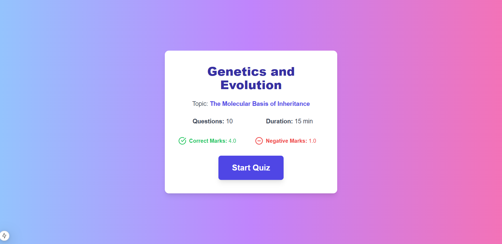
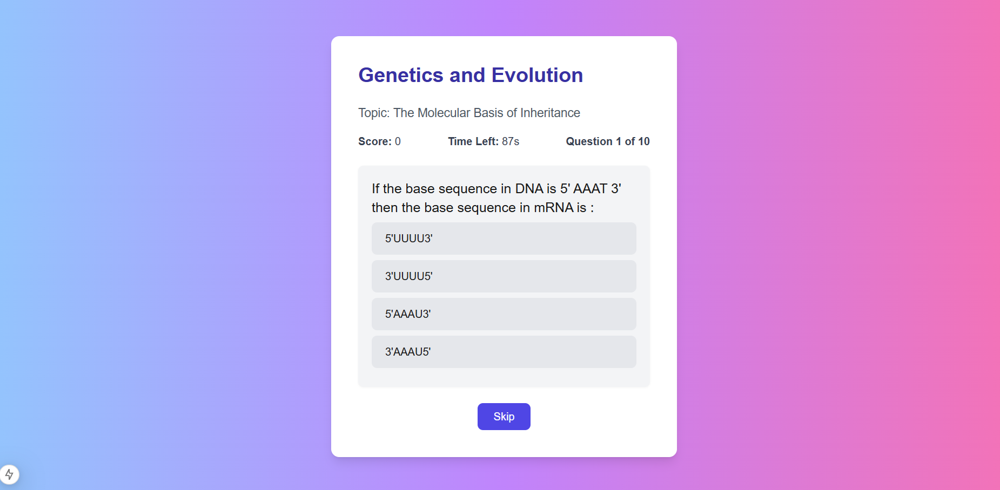
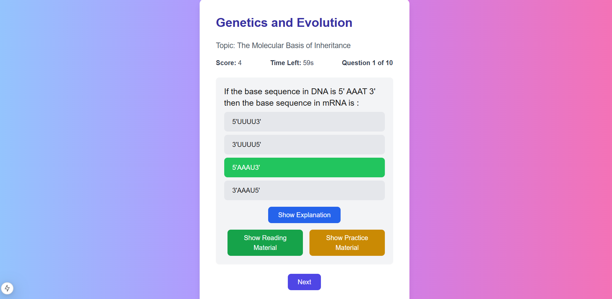

# Quiz Application

This is a [Next.js](https://nextjs.org) project bootstrapped with [`create-next-app`](https://nextjs.org/docs/app/api-reference/cli/create-next-app).

It’s a web-based quiz application that fetches quiz data from an API endpoint and presents it through an intuitive and engaging UI.

## Getting Started

First, run the development server:

```bash
npm run dev
# or
yarn dev
# or
pnpm dev
# or
bun dev
```

Open [http://localhost:3000](http://localhost:3000) with your browser to see the result.

You can start editing the page by modifying `app/page.tsx`. The page auto-updates as you edit the file.

This project uses [`next/font`](https://nextjs.org/docs/app/building-your-application/optimizing/fonts) to automatically optimize and load [Geist](https://vercel.com/font), a new font family for Vercel.

## Handling CORS in Development and Production
This project uses a CORS proxy to solve Cross-Origin Resource Sharing (CORS) issues when fetching data from a public API. In development, the app makes use of the proxy to bypass the CORS issues that occur in the browser. In production, the app directly uses the API URL assuming that CORS is either not an issue or is resolved on the server-side.

### Development (Localhost)
When running the project locally, CORS issues may occur when making requests to the public API. The app uses a CORS proxy (https://api.allorigins.win/get?url=) to bypass these restrictions during development.

To run the project locally with the proxy, follow these steps:

1. Clone the repository.
2. Install dependencies:
    ```bash
    npm install
    ```
3. Set the following environment variables in your .env file:
    ```bash
    NEXT_PUBLIC_API_URL=https://api.jsonserve.com/Uw5CrX
    NEXT_PUBLIC_API_PROXY_URL=https://api.allorigins.win/get?url=
    ```
4. Start the development server:
    ```bash
    npm run dev
    ```

With these settings, the application will use the proxy to make API requests and avoid CORS issues.

### Production (Deployed)
In production, the project assumes that the CORS issue is resolved or doesn't occur, so it directly calls the public API URL without using the proxy.

To deploy the project and make sure it works in production, follow these steps:
1. Set the following environment variable in your hosting platform
    ```bash
    NEXT_PUBLIC_API_URL=https://api.jsonserve.com/Uw5CrX
    ```
2. Deploy the app to your preferred hosting platform 

With these settings, the API will be directly called in production without using the proxy.

## Images




## Video
https://github.com/user-attachments/assets/bbca7f70-003c-400b-b90e-0e08e1ba72bb
